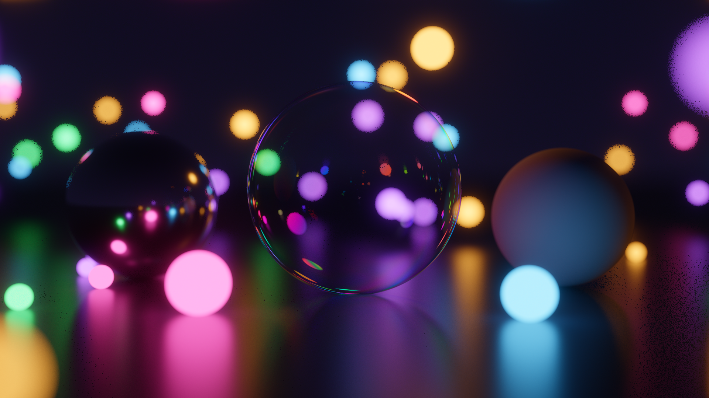

# Path tracer

Two path tracers for the same scenes: a CPU one in C and a spectral one in
CUDA. Neither uses an image library; PNG writing (chunks, CRC, scanline
filtering) is done by hand, with zlib only for deflate.



The colours on the bubble come from actual thin-film interference, computed
per wavelength from the film thickness. That's the main reason the CUDA
version is spectral; the RGB C version can't do it.

---

## Quick start

### C (fastest to get running, no setup)

```sh
gcc -O3 -march=native -ffast-math -funroll-loops -fopenmp -Wall -Wextra \
    pathtracer.c -lz -lm -o pathtracer
./pathtracer --width 960 --spp 144 --depth 16 --out render.png
```

Other scenes are picked at compile time:

```sh
python3 make_scenes.py                      # writes scene.h, scene_cornell.h, scene_boxes.h, scene_neon.h
gcc -O3 -march=native -ffast-math -fopenmp \
    -DSCENE_FILE='"scene_cornell.h"' pathtracer.c -lz -lm -o pathtracer_cornell
```

Flags: `--width --height --spp --depth --out`. Thread count comes from
`OMP_NUM_THREADS`.

### CUDA (spectral, needs an NVIDIA GPU)

```sh
.venv/bin/python gpu/render.py --scene neon  --width 1920 --spp 4096 --max-time 180
.venv/bin/python gpu/render.py --scene hero  --width 1920 --spp 4096 --max-time 180
.venv/bin/python gpu/render.py --scene cornell --width 1200 --height 1200 --spp 8192
```

Environment setup is [below](#setup-for-the-cuda-version). Scenes: `hero`,
`cornell`, `neon`, and the test scenes `mistest` and `furnace-*`.

---

## Results

Default scene. i5-10300H (4C/8T, AVX2) and a GTX 1650 Mobile.

| Renderer | Throughput | 960×540 @ 144 spp |
|---|---:|---:|
| C, AVX2, 8 threads | 22.6 Msamples/s | 3.3 s |
| CUDA, GTX 1650 | 112–139 Msamples/s | — |

CUDA is ~5-6× the C version, and it does more work per sample (4
wavelengths per path, MIS, microfacet metals), so the numbers aren't
directly comparable.

The C intersection loop used to run at 7.7 Msamples/s (9.6 s). gcc
wouldn't vectorize it because it tracked the closest hit and its index in
one running min. Keeping 8 separate per-lane minimums and merging them at
the end lets it vectorize: 2.9× faster on the default scene, 2.8× on neon,
1.45× on the Cornell box (only 9 spheres, so less to gain).

### Thread scaling (C)

| Threads | Time | Speedup | Efficiency |
|---:|---:|---:|---:|
| 1 | 17.57 s | 1.00× | 100% |
| 2 | 9.10 s | 1.93× | 97% |
| 4 | 4.57 s | 3.84× | 96% |
| 8 | 3.31 s | 5.31× | 66% |

Scales well up to the 4 physical cores. Hyperthreading adds another ~1.4×
on top, less than real cores would since they share execution units.

---

## How they work

**C** (`pathtracer.c`): NEE with cone sampling toward sphere lights
(lights picked proportional to power / distance²), Schlick dielectrics,
fuzzy metals, thin lens DOF, Russian roulette, ACES tonemap. One path at a
time per thread. The sphere loop runs 8 spheres at once in AVX2 lanes.
Geometry comes from `scene*.h`, generated by `make_scenes.py`.

Shapes are spheres, planes and boxes. Boxes can be rotated around the
vertical axis, which is enough for the classic Cornell box
(`scene_boxes.h`). Any shape can be a light, but only sphere lights get
shadow rays aimed at them, so plane and box lights are a lot noisier.
Planes and boxes are tested in plain loops, not vectorized; a few dozen
are fine.

**CUDA** (`gpu/`): spectral. 4 wavelengths per path (hero wavelength
sampling), which is what dispersion and thin film need. Also has MIS
between light and BSDF sampling (power heuristic), GGX metals with Turquin
energy compensation, coated diffuse, adaptive sampling, AgX tonemapping,
glare and dithering. The kernel is compiled at runtime with NVRTC.

RGB colours are converted to spectra with a basis from Mallett & Yuksel
2019, solved with constrained optimisation: three smooth curves that sum to
1 at every wavelength, stay in [0,1], and round-trip RGB exactly. The
sum-to-one part is what keeps reflectances from going above 1 at any
wavelength.

---

## Correctness

```sh
.venv/bin/python gpu/test.py
```

**White furnace.** An albedo-1 object in a uniform sky of radiance 1 should
disappear, i.e. every pixel reads 1.0. If it doesn't, energy is being lost
or added somewhere.

| Material | Result |
|---|---:|
| Diffuse | 0.9999 |
| Glass | 0.9999 |
| Dispersive glass | 0.9999 |
| Thin film | 0.9999 |
| Rough conductor | 0.9999 |
| Coated diffuse | 0.9790 |

Dispersive glass passing means the hero wavelength reweighting is right.
Rough conductor was at 0.888 before energy compensation
(`gpu/ggx_albedo.py`), which is the usual single-scattering GGX loss.

**Estimator agreement.** MIS, NEE only and BSDF only should all converge to
the same image. They agree within 0.02%, and MIS has the least noise (1.23×
lower than BSDF only).

**Colour round-trip.** Emitter RGB → spectrum → RGB is off by at most 0.0005.

The table generators check themselves as well: `gpu/sobol.py` tests the
(0,m,2)-net property, and `gpu/spectral.py` prints the round-trip error
(2e-16) and basis bounds.

---

## What didn't work

Both of these are still in the repo since whether they help depends on the
scene.

**Owen-scrambled Sobol.** About 1.1× better per sample but ~50% slower, so
at equal render time plain PRNG wins. Most of the error in these scenes is
from caustic paths, where low-discrepancy sampling doesn't help much. Off
by default, `--ld-groups 8` enables it.

**Adaptive sampling.** First version was 55% slower than uniform, because
once most pixels converge the launches get tiny and latency dominates.
Sizing each launch to a fixed amount of work got it to roughly break-even
(~2% ahead). On by default, `--no-adaptive` disables it.

Benchmarks: `gpu/bench.py` (equal spp) and `gpu/bench2.py` (equal time,
which is the fairer comparison).

---

## Setup for the CUDA version

Needs an NVIDIA GPU and driver. Everything else comes from pip into a venv,
nothing system-wide. `rm -rf .venv` to undo.

```sh
python3 -m venv --without-pip .venv        # Debian often lacks ensurepip
python3 -m pip --python .venv/bin/python install \
    cupy-cuda12x numpy scipy pillow \
    "nvidia-cuda-nvrtc-cu12==12.4.*" "nvidia-cuda-runtime-cu12==12.4.*" \
    "nvidia-curand-cu12==10.3.5.*" "nvidia-cufft-cu12==11.2.*" \
    "nvidia-cublas-cu12==12.4.*"
```

Pin NVRTC to the CUDA version your driver supports (top right of
`nvidia-smi`). A newer NVRTC produces PTX that an older driver can't load.

The lookup tables are committed. To regenerate:

```sh
.venv/bin/python gpu/spectral.py     # RGB -> spectrum basis
.venv/bin/python gpu/sobol.py        # Sobol direction numbers
.venv/bin/python gpu/ggx_albedo.py   # GGX directional albedo
```

The venv ends up around 1.6 GB, nearly all CUDA libraries.

---

## Layout

```
pathtracer.c         C renderer
make_scenes.py       scene definitions, writes the scene*.h headers
gpu/kernel.cu        spectral path tracer (CUDA)
gpu/render.py        host side: scene upload, adaptive loop, post
gpu/png.py           PNG writer
gpu/scenes.py        scene definitions, including test scenes
gpu/test.py          furnace / MIS / colour tests
gpu/bench.py         equal-spp benchmark
gpu/bench2.py        equal-time benchmark
gpu/spectral.py      solves the RGB -> spectrum basis
gpu/sobol.py         Sobol direction numbers + net-property tests
gpu/ggx_albedo.py    GGX directional albedo for energy compensation
render*.png          output
```

Generated headers and lookup tables are committed so a fresh clone builds
without running the generators first.

---

## Known limitations

- **No triangles or meshes.** Spheres, planes and boxes in C; spheres and
  planes on the GPU. For scenes this small a linear loop over objects is
  faster than a BVH, so there isn't one.
- **Caustics are noisy.** Shadow rays can't reach lights through glass, so
  caustics converge slowly. `--clamp` cuts the fireflies but adds bias, so
  it's off by default.
- **Coated diffuse loses 2.1%** of its energy since the coat/base coupling
  is approximate. At least it loses energy rather than creating it.
- **No denoiser.** All the renders here are just run to convergence.
- **Spectral upsampling isn't unique.** Lots of spectra map to the same
  RGB. This basis picks the smoothest energy-conserving one, which is a
  reasonable choice but not "the" spectrum.
